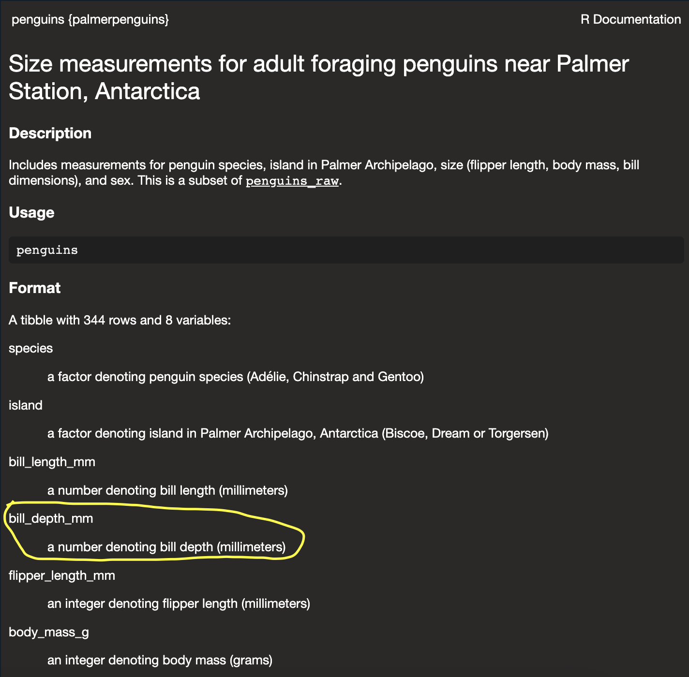

```{r setup, include=FALSE}
# Knitr chunk options
knitr::opts_chunk$set(
	echo = TRUE,
	fig.align = "center",
	message = FALSE,
	warning = FALSE
)
```

# 1.2 First steps
Do penguins with longer flippers weigh more or less than penguins with shorter flippers? You probably already have an answer, but try to make your answer precise. What does the relationship between flipper length and body mass look like? Is it positive? Negative? Linear? Nonlinear? Does the relationship vary by the species of the penguin? How about by the island where the penguin lives? Let’s create visualizations that we can use to answer these questions.

## Load libraries
Load the required libraries.
```{r load-libraries}
library(tidyverse)
library(palmerpenguins)
library(ggthemes)
```

## View the data
```{r view-the-data}
head(penguins)
```
## Build a scatterplot
```{r build-scatter-plot}
# ggplot function defines data source and global mapping attributes
ggplot(
  data = penguins,
  mapping = aes(
    x = flipper_length_mm,
    y = body_mass_g
  )
) +
  # geom functions define the plot type and local mapping attributes
  geom_point(
    mapping = aes(
      colour = species,
      shape = species
    )
  ) +
  geom_smooth(method = "lm") +
  # labs adds labels
  labs(
    title = "Flipper length and body mass",
    subtitle = "Dimensions for Adelie, Chinstrap and Gentoo species",
    x = "Flipper length (mm)",
    y = "Body mass (g)",
    shape = "Species",
    colour = "Species"
  ) +
  # colour theme from ggthemes package
  scale_color_colorblind()
```

## Exercises

1. How many rows are in `penguins`? How many columns?
```{r ex-1-2-1}
nrow(penguins)
ncol(penguins)
```

2. What does the `bill_depth_mm` variable in the `penguins` data frame describe? Read the help for `?penguins` to find out.
```{r ex-1-2-2}
?penguins
```




3. Make a scatterplot of `bill_depth_mm` vs. `bill_length_mm`. That is, make a scatterplot with `bill_depth_mm` on the y-axis and `bill_length_mm` on the x-axis. Describe the relationship between these two variables.
```{r ex-1-2-3}
ggplot(
  penguins,
  aes(
    x = bill_length_mm,
    y = bill_depth_mm,
    colour = species
  )
) +
  geom_point()
```

Reviewing the scatterplot without colour added for species, there appears to be no correlation between bill length and bill depth. However, when we show the species by colour, we can see that each species appears to have a positive correlation (as bill length increases so does bill depth).

4. What happens if you make a scatterplot of `species` vs. `bill_depth_mm`? What might be a better choice of geom?
```{r ex-1-2-4}
ggplot(
  penguins,
  aes(
    x = bill_depth_mm,
    y = species
  )
) +
  geom_point()
```

This scatterplot shows us that each species has a different range of bill depths but it does not answer the question of a relationship between bill depth and bill length.

5. Why does the following give an error and how would you fix it?

```
ggplot(data = penguins) + 
  geom_point()
```
It gives an error because the function `geom_point()` requires `x` and `y` aesthetics to be defined.

6. What does the `na.rm` argument do in `geom_point()`? What is the default value of the argument? Create a scatterplot where you successfully use this argument set to `TRUE`.
```{r ex-1-2-6}
ggplot(
  penguins,
  aes(x = flipper_length_mm,
      y = bill_depth_mm)
) +
  geom_point(na.rm = TRUE)
```

The `na.rm` argument removes all null values before creating the plot. By default it is set to `FALSE`.

7. Add the following caption to the plot you made in the previous exercise: “Data come from the palmerpenguins package.” Hint: Take a look at the documentation for `labs()`.
```{r ex-1-2-7}
# ggplot function defines data source and global mapping attributes
ggplot(
  data = penguins,
  mapping = aes(
    x = flipper_length_mm,
    y = body_mass_g
  )
) +
  # geom functions define the plot type and local mapping attributes
  geom_point(
    mapping = aes(
      colour = species,
      shape = species
    )
  ) +
  geom_smooth(method = "lm") +
  # labs adds labels
  labs(
    title = "Flipper length and body mass",
    subtitle = "Dimensions for Adelie, Chinstrap and Gentoo species",
    caption = "Data come from the palmerpenguins package.",
    x = "Flipper length (mm)",
    y = "Body mass (g)",
    shape = "Species",
    colour = "Species"
  ) +
  # colour theme from ggthemes package
  scale_color_colorblind()
```

8. Recreate the following visualization. What aesthetic should `bill_depth_mm` be mapped to? And should it be mapped at the global level or at the geom level?
```{r ex-1-2-8}
ggplot(
  penguins,
  aes(
    x = flipper_length_mm,
    y = body_mass_g,
    colour = bill_depth_mm
  )
) +
  geom_point() +
  geom_smooth(
    method = "gam"
  )
```

9. Run this code in your head and predict what the output will look like. Then, run the code in R and check your predictions.
```{r ex-1-2-9}
ggplot(
  data = penguins,
  mapping = aes(x = flipper_length_mm, y = body_mass_g, color = island)
) +
  geom_point() +
  geom_smooth(se = FALSE)
```

10. Will these two graphs look different? Why/why not?
```{r ex-1-2-10}
ggplot(
  data = penguins,
  mapping = aes(x = flipper_length_mm, y = body_mass_g)
) +
  geom_point() +
  geom_smooth()

ggplot() +
  geom_point(
    data = penguins,
    mapping = aes(x = flipper_length_mm, y = body_mass_g)
  ) +
  geom_smooth(
    data = penguins,
    mapping = aes(x = flipper_length_mm, y = body_mass_g)
  )
```

# 1.4 Visualising distributions
How you visualize the distribution of a variable depends on the type of variable: categorical or numerical.

## Categorical variable
Use a bar chart.
```{r bar-chart}
penguins |> 
  ggplot(
    aes(
      x = species
    )
  ) +
  geom_bar()
```

We can also reorder the bars based on their frequencies by transforming the variable to a factor and reordering the levels of the factor.
```{r reordered-bar-chart}
penguins |> 
  ggplot(
    aes(
      x = fct_infreq(species)
    )
  ) +
  geom_bar()
```

## Numerical variable
A variable is numerical (or quantitative) if it can take on a wide range of numerical values, and it is sensible to add, subtract, or take averages with those values. Numerical variables can be continuous or discrete.

One commonly used visualization for distributions of continuous variables is a histogram.
```{r histogram}
penguins |> 
  ggplot(
    aes(x = body_mass_g)
  ) +
  geom_histogram(
    binwidth = 200
  )
```

An alternative visualization for distributions of numerical variables is a density plot. A density plot is a smoothed-out version of a histogram and a practical alternative, particularly for continuous data that comes from an underlying smooth distribution.

Imagine a histogram made out of wooden blocks. Then, imagine that you drop a cooked spaghetti string over it. The shape the spaghetti will take draped over blocks can be thought of as the shape of the density curve. It shows fewer details than a histogram but can make it easier to quickly glean the shape of the distribution, particularly with respect to modes and skewness.
```{r density-plot}
penguins |> 
  ggplot(
    aes(x = body_mass_g)
  ) +
  geom_density()
```

## Exercises
1. Make a bar plot of species of penguins, where you assign species to the y aesthetic. How is this plot different?
```{r ex-1-4-1}
penguins |> 
  ggplot(
    aes(y = species)
  ) +
  geom_bar()
```

2. How are the following two plots different? Which aesthetic, `color` or `fill`, is more useful for changing the color of bars?
```{r ex-1-4-2}
ggplot(penguins, aes(x = species)) +
  geom_bar(color = "red")

ggplot(penguins, aes(x = species)) +
  geom_bar(fill = "red")
```

On a bar plot, the `fill` aesthetic is more useful for changing the colour of the bars. The `color` aesthetic only changes the border of the bars, whereas the `fill` aesthetic changes the whole bar colour.

3. What does the `bins` argument in `geom_histogram()` do?
```{r ex-1-4-3}
penguins |> 
  ggplot(
    aes(x = body_mass_g)
  ) +
  geom_histogram(
    bins = 25
  )
```

The `bins` argument sets the number of bars on the histogram.

4. Make a histogram of the `carat` variable in the `diamonds` dataset that is available when you load the tidyverse package. Experiment with different binwidths. What binwidth reveals the most interesting patterns?
```{r ex-1-4-4}
diamonds |> 
  ggplot(
    aes(x = carat)
  ) +
  geom_histogram(
    binwidth = 0.01
  )
```

When you use a binwidth of 0.01, you can see the presence of many modes within the dataset.

# 1.5 Visualising relationships

To visualize a relationship we need to have at least two variables mapped to aesthetics of a plot. In the following sections you will learn about commonly used plots for visualizing relationships between two or more variables and the geoms used for creating them.

## A numerical and a categorical variable
Use a boxplot.
```{r boxplot}
penguins |> 
  ggplot(
    aes(
      x = species,
      y = body_mass_g
    )
  ) +
  geom_boxplot()
```

Alternatively, you could use a density plot.
```{r density-plot-categorical}
penguins |> 
  ggplot(
    aes(
      x = body_mass_g,
      colour = species,
      fill = species
    )
  ) +
  geom_density(
    alpha = 0.5
  )
```

## Two categorical variables
Use stacked bar plots.
```{r stacked-bar-plot}
penguins |> 
  ggplot(
    aes(
      x = island,
      fill = species
    )
  ) +
  geom_bar()
```

Alternatively, use a relative frequency plot.
```{r relative-frequency-plot}
penguins |> 
  ggplot(
    aes(
      x = island,
      fill = species
    )
  ) +
  geom_bar(
    position = "fill"
  )
```

## Two numerical variables
Use a scatter plot.
```{r scatter-plot}
penguins |> 
  ggplot(
    aes(
      x = flipper_length_mm,
      y = body_mass_g
    )
  ) +
  geom_point()
```

## Three or more variables
We can incorporate more variables into the plot by mapping them to additional aesthetics (e.g. colour)
```{r scatter-four-variables}
penguins |> 
  ggplot(
    aes(
      x = flipper_length_mm,
      y = body_mass_g
    )
  ) +
  geom_point(
    aes(
      colour = species,
      shape = island
    )
  )
```

However adding too many aesthetic mappings to a plot makes it cluttered and difficult to make sense of. Another way, which is particularly useful for categorical variables, is to split your plot into facets, subplots that each display one subset of the data.
```{r scatter-facet-wrap}
penguins |> 
  ggplot(
    aes(
      x = flipper_length_mm,
      y = body_mass_g
    )
  ) +
  geom_point(
    aes(
      colour = species
    )
  ) +
  facet_wrap(~island)
```

## Exercises

1. The `mpg` data frame that is bundled with the ggplot2 package contains 234 observations collected by the US Environmental Protection Agency on 38 car models. Which variables in `mpg` are categorical? Which variables are numerical? (Hint: Type `?mpg` to read the documentation for the dataset.) How can you see this information when you run `mpg`?
```{r ex-1-5-1}
glimpse(mpg)
```

`manufacturer`, `model`, `trans`, `drv`, `fl` and `class` are categorical. `displ`, `year`, `cyl`, `cty` and `hwy` are numerical.

2. Make a scatterplot of `hwy` vs. `displ` using the `mpg` data frame. Next, map a third, numerical variable to `color`, then `size`, then both `color` and `size`, then `shape`. How do these aesthetics behave differently for categorical vs. numerical variables?
```{r ex-1-5-2}
mpg |> 
  ggplot(
    aes(
      x = hwy,
      y = displ,
      colour = drv,
      size = cty,
      shape = fl
    )
  ) +
  geom_point()
```

You cannot map a continuous variable to the `shape` aesthetic. When a numerical variable is mapped to `colour` it takes on a gradient palette but when a categorical variable is mapped to `colour` it takes on a palette of distinct colours.

3. In the scatterplot of `hwy` vs. `displ`, what happens if you map a third variable to `linewidth`?
```{r ex-1-5-3}
mpg |> 
  ggplot(
    aes(
      x = hwy,
      y = displ,
      linewidth = drv
    )
  ) +
  geom_point()
```

Nothing happens - there is no line to alter the width of, so the code runs as if it wasn't there.

4. What happens if you map the same variable to multiple aesthetics?
```{r ex-1-5-4}
mpg |> 
  ggplot(
    aes(
      x = displ,
      y = cty,
      colour = manufacturer,
      shape = manufacturer
    )
  ) +
  geom_point()
```

5. Make a scatterplot of `bill_depth_mm` vs. `bill_length_mm` and color the points by `species`. What does adding coloring by species reveal about the relationship between these two variables? What about faceting by species?
```{r ex-1-5-5}
penguins |> 
  ggplot(
    aes(
      x = bill_depth_mm,
      y = bill_length_mm
    )
  ) +
  geom_point(
    aes(
      colour = species
    )
  )

penguins |> 
  ggplot(
    aes(
      x = bill_depth_mm,
      y = bill_length_mm
    )
  ) +
  geom_point() +
  facet_wrap(~species)
```

Colouring by species reveals clusters of points by species. Each species appears to have a positive correlation.

6. Why does the following yield two separate legends? How would you fix it to combine the two legends?
```{r ex-1-5-6}
ggplot(
  data = penguins,
  mapping = aes(
    x = bill_length_mm, y = bill_depth_mm, 
    color = species, shape = species
  )
) +
  geom_point() +
  labs(color = "Species", shape = "Species")
```

It yields two legends because only `colour` was included in the `labs()` function. You can fix it by adding `shape` to the `labs()` functions as well.

7. Create the two following stacked bar plots. Which question can you answer with the first one? Which question can you answer with the second one?
```{r ex-1-5-7}
ggplot(penguins, aes(x = island, fill = species)) +
  geom_bar(position = "fill")
ggplot(penguins, aes(x = species, fill = island)) +
  geom_bar(position = "fill")
```

The first plot shows the distribution of species by island. The second shows the distribution of islands by species.

# 1.6 Saving your plots
You can save the last plot created using `ggsave()`. You can specify dimensions (width and height) when you run this function for reproducible code.

## Exercises

1. Run the following lines of code. Which of the two plots is saved as mpg-plot.png? Why?
```{r ex-1-6-1}
ggplot(mpg, aes(x = class)) +
  geom_bar()
ggplot(mpg, aes(x = cty, y = hwy)) +
  geom_point()
ggsave("plots/mpg-plot.png")
```

The second plot is saved because it is the most recently created plot.

2. What do you need to change in the code above to save the plot as a PDF instead of a PNG? How could you find out what types of image files would work in `ggsave()`?
```{r ex-1-6-2}
ggplot(mpg, aes(x = cty, y = hwy)) +
  geom_point()
ggsave(
  "plots/mpg-plot.pdf",
  device = "pdf"
)
```

You would need to change both the extension in the filename and the `device` argument. You can find this out by running `?ggsave` in the console.

